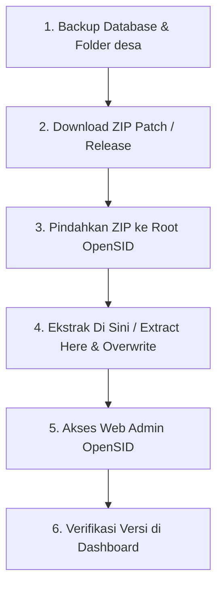

# Panduan Update OpenSID via Copy-Paste (ZIP)

Dokumen ini berisi panduan langkah demi langkah untuk melakukan pembaruan (update/patch) OpenSID secara manual menggunakan metode ekstraksi dan timpa file (*copy-paste* / *overwrite*).

---

> [!IMPORTANT]
> **PRASYARAT WAJIB**: Lakukan **Backup Database** dan **Backup Folder `desa/`** (terutama `desa/config/` yang berisi pengaturan koneksi database) sebelum memulai proses update!

---

## 📋 Ringkasan Langkah Update

---

## 1. Unduh (Download) Patch / Release

1. Buka tautan patch / rilis OpenSID:
   👉 **[OpenSID Repository (Patch 2607.0.1)](https://github.com/OpenSID/OpenSID/tree/patch-2607.0.1)**
2. Klik tombol **Code** (berwarna hijau) lalu pilih **Download ZIP**, atau unduh file `.zip` dari daftar **Releases**.
3. Simpan file `.zip` di komputer Anda.

---

## 2. Persiapan Sebelum Copy-Paste

1. **Hentikan Web Server sementara** (Laragon / XAMPP / Nginx) untuk menghindari file terkunci (*file lock*).
2. **Amankan Data & Konfigurasi Penting**:
   Pastikan folder **`desa/`** di-backup ke tempat aman. Konfigurasi OpenSID (seperti koneksi database) berada di dalam folder ini:
   - `desa/config/config.php` (konfigurasi aplikasi)
   - `desa/config/database.php` (konfigurasi koneksi database)
   - Berkas media, foto, dokumen, dan modul kustomisasi di dalam folder `desa/`

---

## 3. Ekstrak Langsung di Folder Project OpenSID

1. Pindahkan / salin berkas `.zip` patch yang sudah diunduh ke dalam **folder utama (root) proyek OpenSID** Anda (misalnya `d:\PROJECT OPENDESA\opensid\`).
2. Klik kanan pada berkas `.zip` tersebut.
3. Pilih **Extract Here** (atau *Ekstrak Di Sini* menggunakan WinRAR / 7-Zip / aplikasi zip OS Anda).
4. Ketika muncul konfirmasi timpa file/folder (*Replace/Overwrite*), pilih **Yes to All / Replace All** (Timpa Semua).
5. (Opsional) Setelah selesai diekstrak, Anda dapat menghapus berkas `.zip` tersebut.

> [!WARNING]
> Proses ekstraksi langsung di tempat (*Extract Here*) akan menimpa file-file sistem OpenSID dengan versi terbaru. Folder `desa/` Anda tidak akan terhapus, tetapi pastikan backup folder `desa/` tetap sudah dilakukan sebelumnya.

---

## 4. Akses Web OpenSID & Migrasi Otomatis

1. **Nyalakan kembali Web Server** (Laragon / XAMPP).
2. Buka browser dan **akses halaman Administrator OpenSID**.
3. Sistem OpenSID akan secara otomatis mendeteksi pembaruan versi dan menjalankan migrasi database yang diperlukan saat halaman dibuka.

---

## 🔍 Checklist Verifikasi Pasca-Update

- [ ] Versi OpenSID pada footer / dashboard admin menunjukkan versi `2607.0.1`.
- [ ] Fitur utama aplikasi berjalan dengan normal.
- [ ] Berkas dan media pada folder `desa/` tetap terbaca dengan benar.
- [ ] Tidak ada galat SQL atau halaman kosong (*blank page*). Jika ada galat, periksa berkas log di `storage/logs/laravel.log`.
